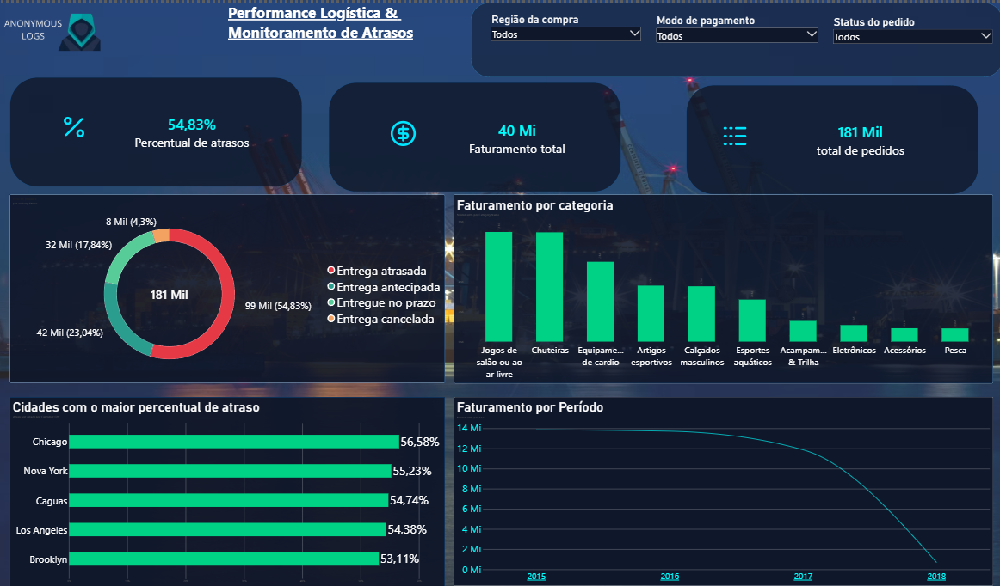

# 📊 Supply Chain & Logistics Analytics Dashboard
## 📸 Resultado Final



## 📌 Visão Geral do Projeto
Este projeto consiste em um dashboard analítico focado em **Supply Chain, Logística e Performance de Vendas**, desenvolvido no Power BI. O objetivo principal é monitorar os principais KPIs operacionais e financeiros para apoiar a tomada de decisão estratégica em logística e distribuição.

---

## 🛠️ Tecnologias & Ferramentas
* **Power BI**: Modelagem de dados, criação de métricas DAX e construção da interface interativa em Dark Mode.
* **Figma & Lucide Icons**: Design da interface visual, vetores customizados e componentes UX/UI.
* **SQL / Excel**: Fonte e estruturação inicial dos dados operacionais.
* **Git & GitHub**: Versionamento de código e documentação técnica do repositório.

---

## 💡 Principais Métrica & Destaques (KPIs)
* **Percentual de Atrasos**: Métrica crítica de acompanhamento logístico para eficiência de entregas (`54,83%`).
* **Faturamento Total**: Visão financeira acumulada dos pedidos executados (`R$ 40 Mi`).
* **Total de Pedidos**: Volume total de requisições processadas no sistema (`181 Mil`).
* **Distribuição de Entregas**: Análise do status da logística (no prazo, antecipada, atrasada e cancelada).
* **Faturamento por Categoria & Cidade**: Identificação dos principais mercados consumidores e produtos líderes em vendas.

---
## 📊 Insights & Diagnóstico de Negócio

### 🚚 Gargalos Logísticos em Praças Críticas
- **Polo de Volume (Caguas):** Concentra a maior fatia do faturamento, mas sofre com ineficiências operacionais que colocam a receita principal em risco.
- **Centros Estratégicos (Chicago e New York):** Altas taxas de atraso em grandes metrópoles prejudicam a percepção de marca e a retenção de clientes em mercados de alta visibilidade.
- **Plano de Ação Sugerido:** Reestruturar contratos de frete regional e estabelecer SLAs unificados de entrega para praças estratégicas.

### 📉 Análise de Tendência (2017 - 2018)
- **Declínio Acentuado:** Observa-se uma queda drástica no volume de faturamento a partir de 2017, atingindo os menores patamares em janeiro de 2018.
- **Causa Raiz:** A taxa global de atrasos de **54,83%** gerou perda progressiva de clientes recorrentes, impactando diretamente o LTV e o faturamento total da operação.

## 📁 Estrutura do Repositório
```text
├── dashboard_preview.png   # Imagem de demonstração do painel
├── meu_novo_repo.pbix      # Arquivo principal do Power BI
└── README.md               # Documentação técnica do projeto
